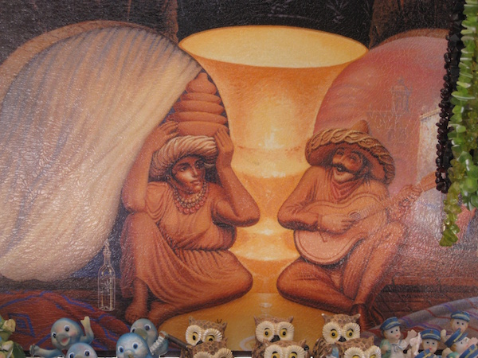
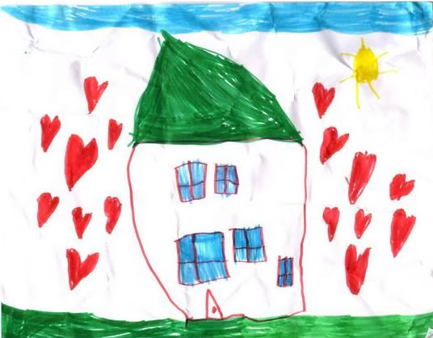

# Energizers

I tried to include one of these in every session. The aim of a good energizer is to
* Stop the kids from getting bored
* Get everyone to feel more comfortable participating in the workshop
* Have the kids flex their communication skills

### The Pulse Game

The basic premise of this game is simulating an electric current by squeezing the hand of the person next to you.

I roughly followed [these detailed instructions](http://www.group-games.com/action-games/pulse-game.html).

Since it is a coding bootcamp, take this opportunity to talk about how computers! Messages get passed from the keyboard to the computer just like how they passed a message across the room with their hand squeezes.

### Optical Illusions

_On the surface this activity has absolutely no point at all._

Just look at optical illusions and talk about them.

    

### A Picture in 1000 Words

_On the surface this activity also has no apparent point._

Pick one volunteer to be the "artist" and the rest of the room will give them instructions.

Show a picture like the one below so that everyone except the artist can see it.

Now, each kid takes their turn to give a one sentence instruction to the artist on what to draw.
It's important that the artist cannot ask for clarification. This activity is all about _precise_ communication. The goal is to give such good instructions to the artist that they perfectly recreate the image.

    

