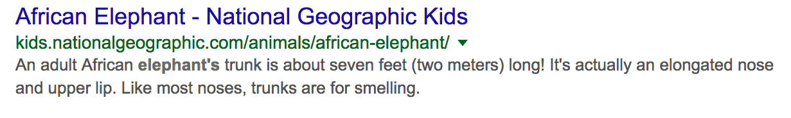
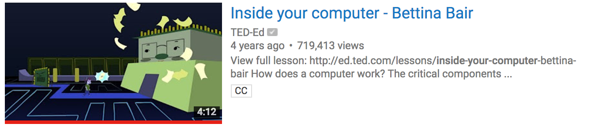
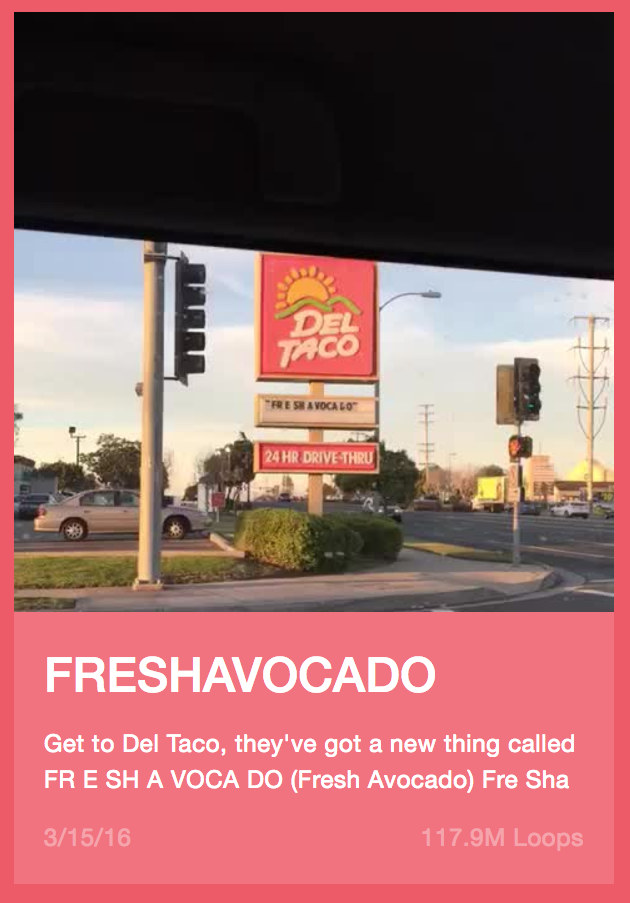

# Warm Ups / Exercises

These activities can be as short as a few minutes, or as long as one to two hours.
I've listed these in the order that I would use them (most basic to most advanced).

### Inspect that Element

This exercise is one of the first ways I introduced the basics of HTML.
If you can, start by demonstrating to everyone how to use the 'Inspect Element' feature of your web browser.
Show to them that you can change a little of bit of code and it will change how to page looks. Distribute a copy of the [handout](inspect.pdf) to each kid and have them fill it out as they go along.

### Meet the HTML Tag Family

An introduction to the various HTML tags.

Since this material is a bit dry, I used some deception to make it appear less painstaking to the kids.
After distributing the [handout](family.pdf), let them know that they were _supposed_ to fill it out entirely by themselves, but you'll give them a break. Each kid gets assigned one row of the table to fill out.
They can use W3Schools or simple search on Google to find the answers.
Afterward, take up the answers with everybody.

_Note: The "special attributes" column of the handout is mostly intended for a few select tags. E.g. the `src` attribute for the `img` tag._

### W3Schools

W3schools provides a hige set of exercises that can be completed in the browser.
I like using them because every exercise has a hint and a solution the kids can use when they get stuck.

I recommend combing through the [HTML](https://www.w3schools.com/html/exercise.asp) or [CSS](https://www.w3schools.com/css/exercise.asp) exercises to find a subset that you will give the kids to work on.

### Fix my Code

This exercise is great when the kids have started learning the syntax of HTML.
(We too easily take language syntax for granted)

Simply open up a text editor (or use a whiteboard) and write some HTML with a couple mistakes thrown in.
Ask the room what you did wrong, and how to fix it. I recommend taking any answer you get literally, even if it means making more mistakes! Either you'll get corrected, or this is a good time to slow down and spend more time on the material you've already covered.

##### Example:

Q: "What's wrong with this?"

``

A: "You need quoutes around the source!"

### The Copycat

After the kids were confident in writing HTML and CSS by themselves, I challenged them to recreate some iconic designs from scratch.
This exercise involves using different tags and styles, as well as applying margins/padding to elements.
Below are the images I gave them:

#### A Google Search result

#### A single tweet

#### A Youtube video

#### A video thumbnail on Vine

